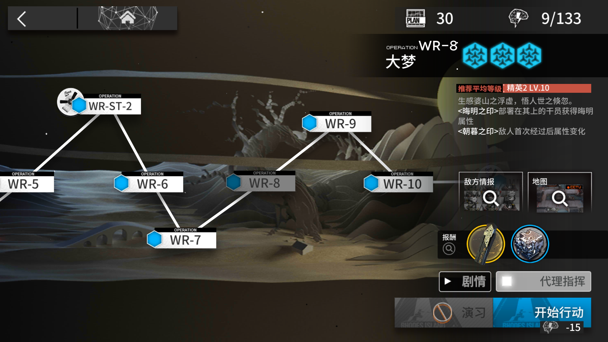

# 使用手册

## 初次上手

1. 打开程序，跟着提示完成配置。
2. 用模拟器打开选关界面，选择关卡，确认当前界面和图片上的差不多，**勾选代理作战**。

3. 程序会提示输入计划。输入 `2`，然后按回车。
4. 解放双手，现在已经开始自动刷关了！刷关进程将会在理智消耗完毕时自动停止。

## 计划

刷关时，你需要输入“计划”。计划的格式为：  
`[刷关模式][刷关次数][后续动作列表]`

### 示例

计划|说明
-|-
`02`|刷关2次
`2es`|刷关直到理智耗尽，随后关闭模拟器，使计算机睡眠
`3`|一直刷关，直到手动关闭程序

### 刷关模式列表

代码|功能|说明
-|-|-
0|指定次|如果理智不够完成刷关次数会卡住在用道具回复理智的界面
1|指定次，当理智耗尽时等待恢复|功能同上且不会出现上列问题
2|直到理智耗尽|
3|当理智耗尽时等待恢复|需要手动关闭程序，任何后续动作不会执行
