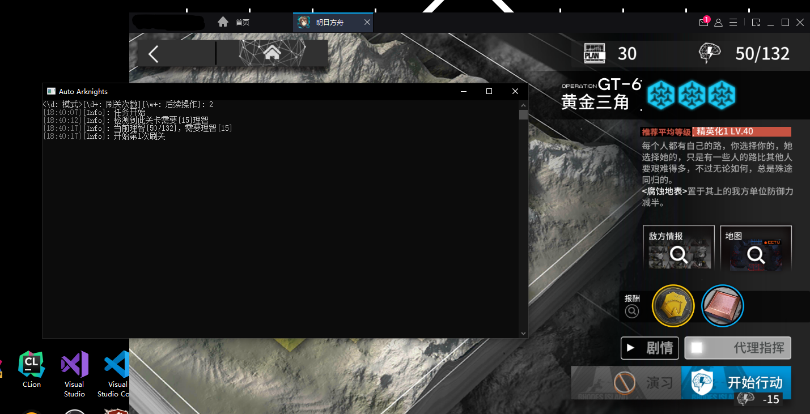

# Auto Arknights

  
   
*用于自动化明日方舟刷关的程序。*  
*For non-CN server Arknights players:* now this program **only** works for CN server

## 运行

确保你已了解下面的“必须运行要求”和“如何使用”章节后由[此处](../../releases/latest)下载，运行`Auto Arknights CLI.exe`。

### 必须运行要求

* 最新版的 `.NET 5.0 Preview`。([官方下载](https://dotnet.microsoft.com/download/dotnet-core/5.0))
* CPU支持`AVX2`指令集且支持`x64`架构。
* 系统为`Windows`，版本为7及以上，目标架构为`x64`。  

### 如何使用

参见 [使用手册](../wiki/Home)

## 构建

1. 切换到项目根目录。  
2. 运行`build-winx64.ps1`，构建成果在`artifact/`。

## 关于

开发者并没有很多经验，如果有问题欢迎提出`issue`。

### 鸣谢

[Jetbrains](https://www.jetbrains.com/) 为本项目提供了免费的开源项目开发用许可证，这对本项目的开发有很大的帮助。
