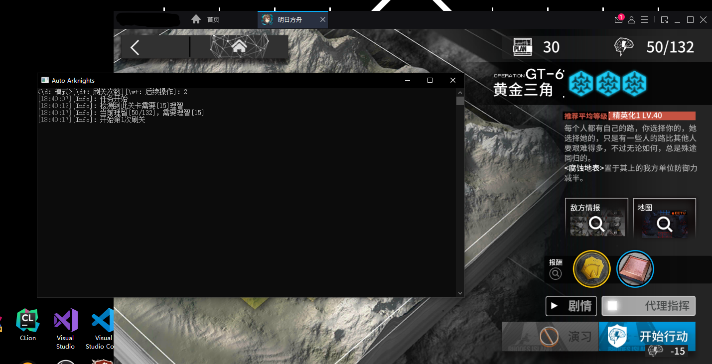

# Auto Arknights 

*用于自动化明日方舟刷关的程序。*  

## 入门

> [主程序下载](../../releases/latest)  
> [使用手册](../../wiki/Home)

### 必须运行要求

* CPU 支持 AVX2 指令集。
* Windows 7 x64 或更高版本的操作系统。
* .NET 5.0 运行时，[官方下载](https://dotnet.microsoft.com/download/dotnet/current/runtime)。

### 注意事项

* 本程序不支持外服（非大陆服务器），因为暂时没有相关素材。
* 原理上，使用本程序没有被判定为作弊的风险，因为几乎是模拟的用户操作。但是，作者不对本程序的安全性作保证。

## 关于

这个项目是实验性的，供学习使用，在使用中如果有问题欢迎提出 issue。  

### 鸣谢

  
JetBrains 为本项目提供了免费的开源项目开发用许可证，这对本项目的开发有很大的帮助。
