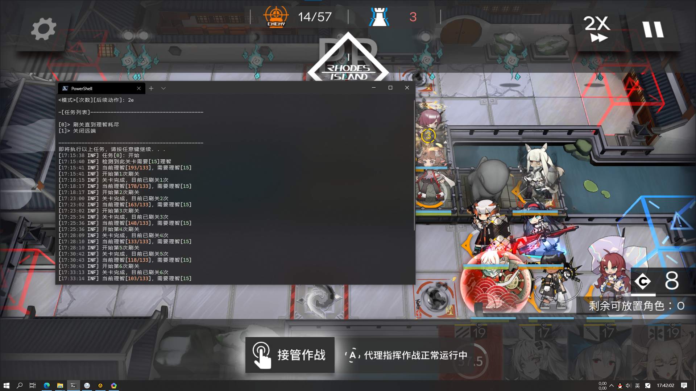
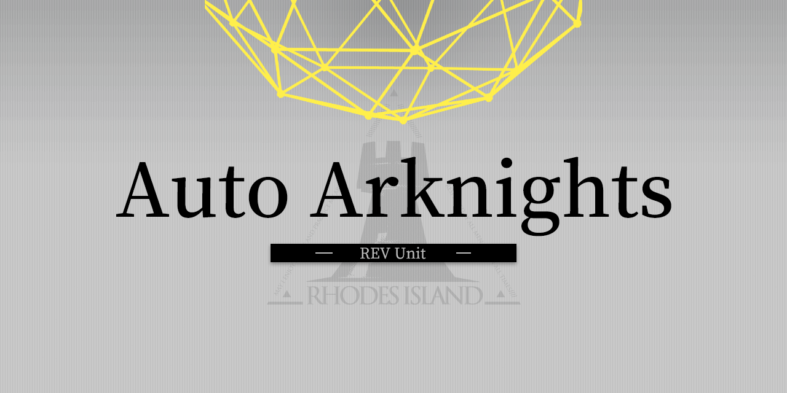

# Auto Arknights

  
*用于自动化明日方舟部分操作的程序。*  
特色：相比连点，更加稳定，更不容易出错；相比同类自动化程序，更加快速轻量。

## 入门

> [程序下载](https://github.com/CCRcmcpe/Auto-Arknights/releases)  
  [使用手册](Docs/zh-cn/使用手册.md)

### 运行最低要求

* Windows 7 x64 或更高版本的操作系统。
* .NET 5.0 运行时，[官方下载](https://dotnet.microsoft.com/download/dotnet/current/runtime)。

### 注意事项

* 本程序不支持国服以外的明日方舟区服。
* 原理上，使用本程序没有被判定为作弊的风险；但是作者不对使用此程序造成的任何损失负责。

## 关于

  
这个项目是实验性的，仅供学习使用，在使用中如果有问题欢迎提出 issue。

### 鸣谢

  
JetBrains 为本项目提供了免费的开源项目开发用许可证，这对本项目的开发有很大的帮助。
